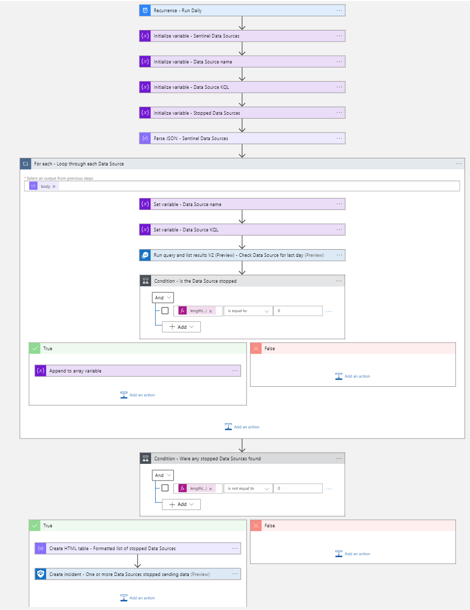
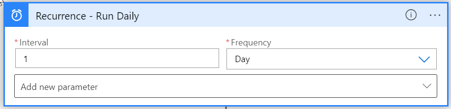
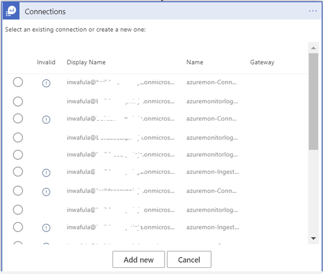
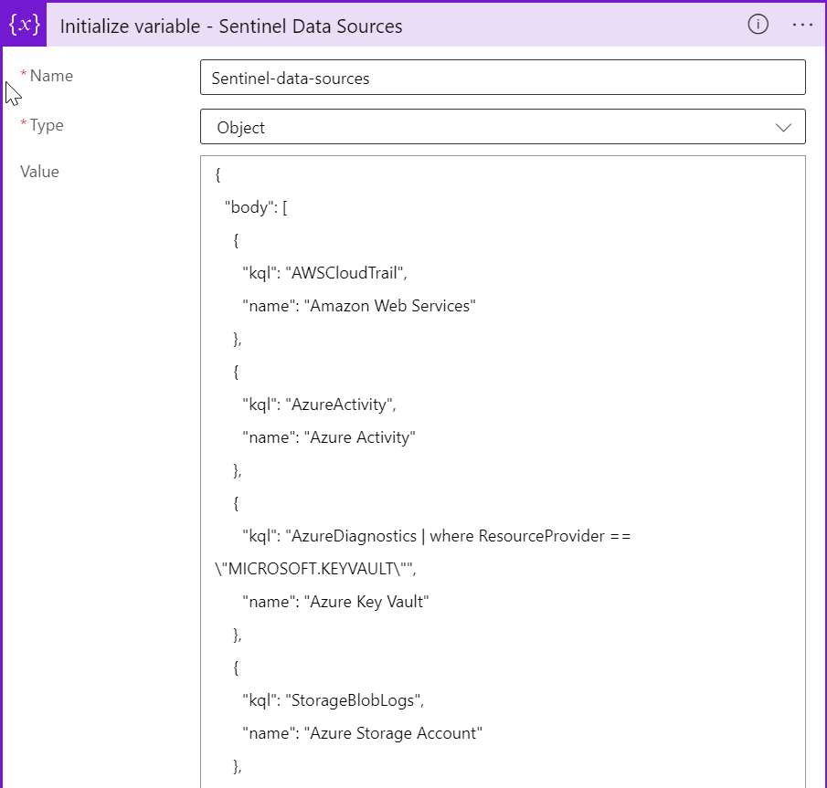
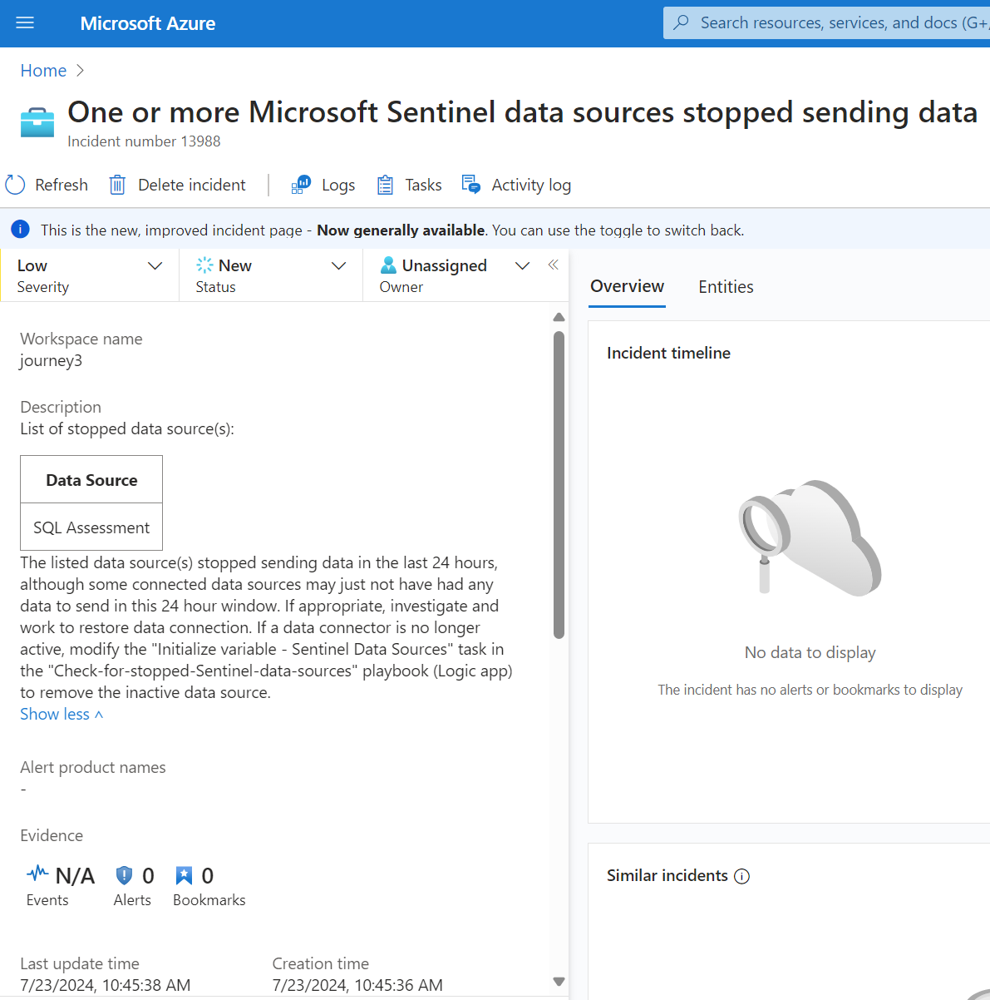

# Create Microsoft Sentinel Incident on Missing Data Source Solution
Author: John Joyner

Consumption plan Logic App has one (1) trigger and fourteen (14) steps.

This solution will create a Microsoft Sentinel incident when one or more data sources are discovered to have sent no data in the previous 24 hours.

### Click to Deploy to Azure

<a href="https://portal.azure.com/#create/Microsoft.Template/uri/https%3A%2F%2Fraw.githubusercontent.com%2Fjohn-joyner%2FPlaybooks%2Fmain%2FCreate-Incident-on-missing-Data-Source%2Fazuredeploy.json" target="_blank">
     
</a>

<a href="https://portal.azure.us/#create/Microsoft.Template/uri/https%3A%2F%2Fraw.githubusercontent.com%2FAzure%2FAzure-Sentinel%2Fmaster%2FPlaybooks%2FCreate-Incident-on-missing-Data-Source%2Fazuredeploy.json" target="_blank">
     
</a>

### IMPORTANT POST DEPLOYMENT STEPS

1. The "<b>Initialize variable - Sentinel Data Sources</b>" step of the Logic App must be customized with the data sources expected in the environment (details provided below in this README).

2. The Logic App creates and uses a Managed System Identity (MSI) to authenticate with Azure Log Analytics and Microsoft Sentinel. Assign RBAC '<b>Log Analytics Reader</b>' and '<b>Microsoft Sentinel Contributor</b>' roles to the Logic App at the Management Group, Subscription, Resource Group, or Log Analytics Workspace level.

### Overview of the steps the Logic App works through 

The Logic App loops through each data source (specified in the first 'Initialize variable' task in the Logic App) and checks for that data type in the Log Analytics workspace, appending missing data source name(s) to an array. If any data source is found to have no recent data in the workspace, a low severity Microsoft Sentinel incident is created that includes an HTML table of the array listing the missing data source name(s).



### The Logic App is activated by a Recurrence trigger whose frequency of execution can be adjusted to your requirements:



### Since the Logic App is being deployed from an ARM template you will need to make connections to Log Analytics and Microsoft Sentinel before the Logic App can work in your environment. You can expect to see windows like the one below. Click “Add new” to create a connection for each of the three resources. 

 

### The "Initialize variable - Sentinel Data Sources" task in the Logic App must be customized for your environment.

The variable is pre-populated with a number of data sources to get you started. Delete the data sources you don't have in your environment and add those not already in the list.

Each data source is specified as an array with two "attribute : value" pairs like this:

```
   {
      "kql": "AWSCloudTrail",
      "name": "Amazon Web Services"
   },
```
To add additional data sources, the "kql" value is what you would use in the Log Analytics log viewer to query for that data source, also known as the Table name, possibly augmented with one or more "| where" filters. The "name" value is any text string that is meaningful to you to describe that data source.

If any KQL or Name value contains quote marks ("), these must be escaped with a backslash {\\}, so that you actually have backslash-quote (\\") specified in the Logic App. See this example where the KQL contains a "| where" filter with quote marks:

```
   {
      "kql": "CommonSecurityLog | where DeviceVendor == \"Fortinet\" | where DeviceProduct startswith \"Fortigate\"",
      "name": "Fortinet"
   },
```

Remember that each array needs a comma after the closing curly bracket, except for the last array in the list which does not have a comma.

  

### Below is an example Microsoft Sentinel incident created by the Logic App:

   


